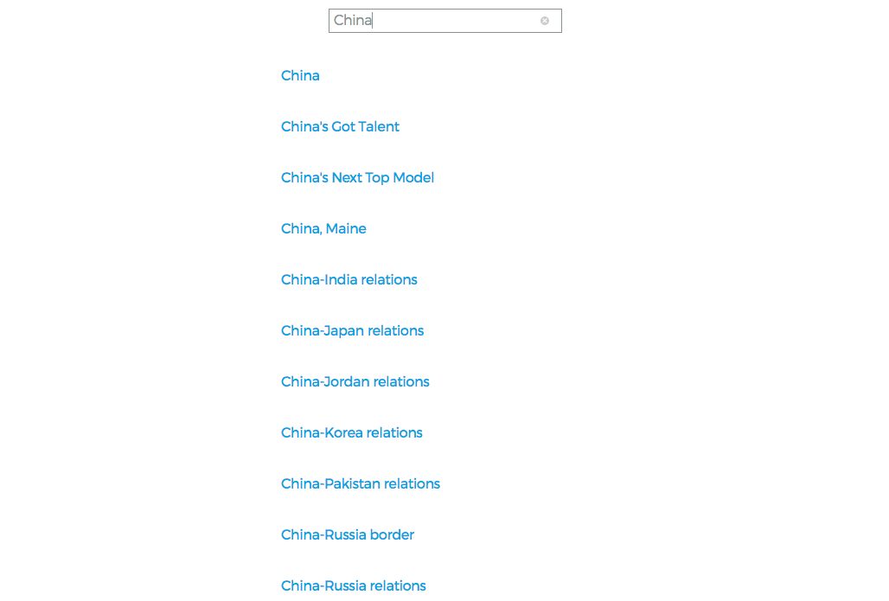
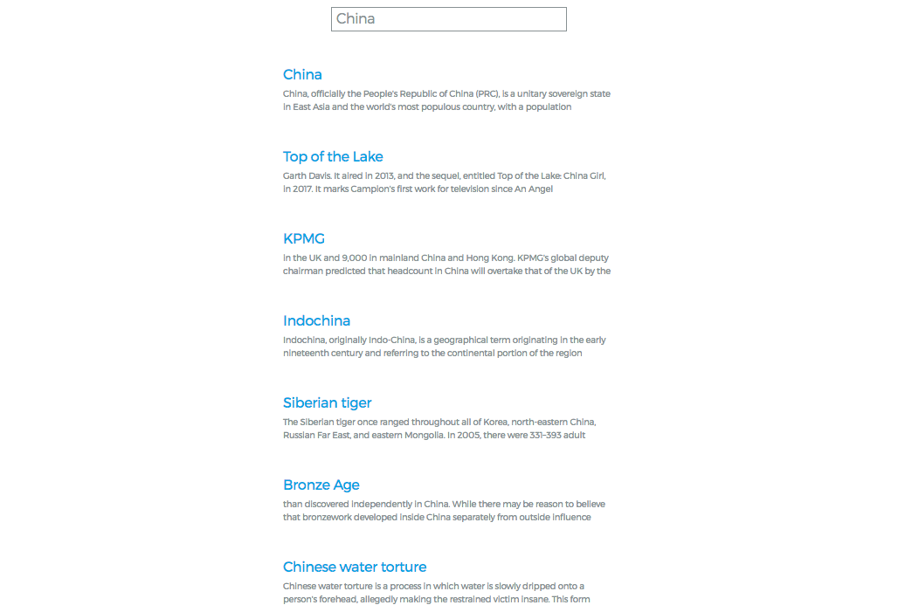

# System1

Built using Node, Grunt, Angular, and SASS.

If you'd like to run tests, the command is 'grunt test'. You'll need to install node, do a npm install, and install the global grunt cli before.

For SASS I used BEM style classes because my current team has seen a lot of benefit (mostly with directives but for consistency it's used everywhere). 

I'm absolutely open to any discussion on anything -- learning and understanding that each project has differences is a huge key to being a dev. Please let me know any feedback you have as well. Thanks! 

## My app screenshots for comparison:

### Step 1

### Step 2

### Step 3

